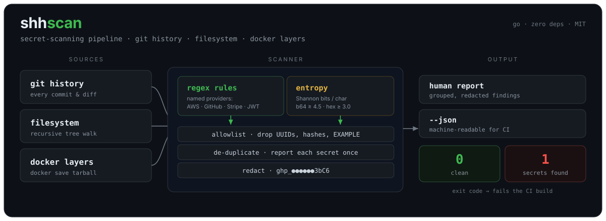
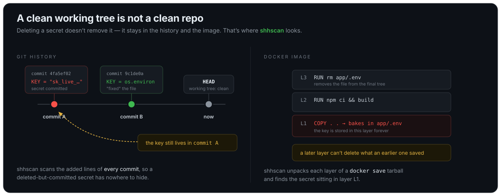
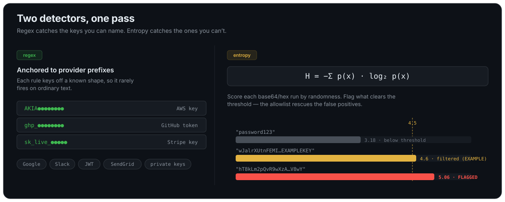

<h1 align="center">shhscan</h1>

<p align="center">
  Find leaked secrets in <strong>git history</strong>, <strong>Docker images</strong>, and your <strong>filesystem</strong>.<br>
  Regex for the keys you can name, Shannon entropy for the ones you can't. One binary, zero dependencies.
</p>

<p align="center">
  
  
  
  
  <a href="https://github.com/SpenceChakabva/shhscan/actions/workflows/ci.yml"></a>
</p>

<p align="center"></p>

```console
$ shhscan git .
[git] aws-access-key-id  config.py:2
    commit 4fa5ef02  spence  2 commits ago
    AKIA************SYUZ
[git] entropy base64 5.06  config.py:4
    1BG4****************************CBXR

shhscan: 2 finding(s)
```

`shhscan` is a single static binary that scans the three places credentials actually hide. It pairs high-signal regex rules with Shannon-entropy detection, redacts what it finds, and **exits non-zero on a hit** so it drops straight into a pre-commit hook or CI pipeline.

**Runs anywhere Go does** — Linux, macOS, and Windows (amd64 and arm64). Pre-built binaries are attached to every [release](https://github.com/SpenceChakabva/shhscan/releases); download one and run it, no toolchain required, and verify it against `checksums.txt`.

---

## Why it exists

A secret doesn't have to be in your current code to hurt you. Delete an API key in a later commit and it's still sitting in the old one; `COPY` a `.env` into an early Docker layer and it stays in the image even after a later layer removes the file.

<p align="center"></p>

I maintain client environments at an MSP, so this is a real recurring problem — a clean working tree is not a clean repo. `shhscan` looks in **old commits, image layers, and the working tree**, not just the files you have checked out today.

## Install

```console
$ go install github.com/SpenceChakabva/shhscan@latest
```

Or build from source (Linux, macOS, and Windows):

```console
# Linux / macOS
$ git clone https://github.com/SpenceChakabva/shhscan
$ cd shhscan && go build -o shhscan .
```

```powershell
# Windows (PowerShell)
git clone https://github.com/SpenceChakabva/shhscan
cd shhscan; go build -o shhscan.exe .
```

### Windows notes

shhscan is pure Go and runs natively on Windows — no WSL required. It shells out to `git` (install Git for Windows) and, for `docker` scans, uses `tar` (built into Windows 10 1803+). Use `.\shhscan.exe` and PowerShell paths:

```powershell
.\shhscan.exe git .
.\shhscan.exe fs .\src
.\shhscan.exe docker .\image.tar
```

## Usage

```
shhscan git    [path]          scan full commit history (default: .)
shhscan fs     <path>          scan a directory tree
shhscan docker <image.tar>     scan a 'docker save' tarball
```

Scan a Docker image:

```console
$ docker save myapp:latest -o image.tar
$ shhscan docker image.tar
```

| Flag | Meaning |
|------|---------|
| `--json` | machine-readable output for CI |
| `--no-redact` | print full secrets (handle with care) |
| `--no-regex` / `--no-entropy` | disable one detector |
| `--base64-entropy F` | base64 entropy threshold (default 4.5) |
| `--hex-entropy F` | hex entropy threshold (default 3.0) |
| `--allow RE[,RE...]` | extra allowlist regexes |
| `--exclude GLOB[,...]` | skip files whose path matches a glob (e.g. `*_test.go,testdata/*`) |
| `--max-commits N` | (git) limit history depth |

Exit codes: `0` clean · `1` secrets found · `2` error. To silence a single known-safe line inline, add a `shhscan:allow` comment to it.

## How detection works

Regex only catches secrets whose *shape* you anticipated. Everything else — a random 40-character API secret with no prefix — is caught statistically, by measuring per-character randomness.

<p align="center"></p>

A repeated string like `aaaa` scores `0`; `password` scores low; a real credential approaches its character set's ceiling (~6 bits/char for base64). shhscan flags base64 runs above **4.5** and hex runs above **3.0** bits/char — the classic trufflehog defaults, both tunable.

Entropy's weakness is that UUIDs, content hashes, and base64 fixtures also look random. The built-in allowlist filters those (UUIDs, 32/40/64/128-char hex digests, and obvious placeholders like `EXAMPLE`), which is why the canonical AWS *example* keys are never reported.

## Try it

```console
$ make demo            # Linux / macOS
```

```powershell
.\scripts\demo.ps1     # Windows (PowerShell)
```

This seeds three throwaway fixtures with **freshly generated** random secrets (a git repo with a secret buried in history, a file tree mixing real secrets with false positives, and a synthetic `docker save` tarball) and runs all three scans plus the allowlist check. Nothing sensitive is committed — the seed script generates secrets at runtime, so the repo's own CI self-scan stays green.

`testdata/allowlist-cases/` holds committed false-positive fixtures. The integration test asserts shhscan reports **zero** findings there — the regression guard for false-positive filtering.

## Use in CI

```yaml
- name: Scan for secrets
  run: |
    go install github.com/SpenceChakabva/shhscan@latest
    shhscan git . --exclude '*_test.go,testdata/*'
```

The non-zero exit on findings fails the build automatically. As a pre-commit hook, drop `scripts/pre-commit` into `.git/hooks/`.

## Honest limitations

Rebuilding a scanner from scratch — rather than running `gitleaks` — was the point. You understand a detector's blind spots only once you've written one.

- **No live verification.** shhscan tells you a string *looks* like a secret; trufflehog additionally calls the provider's API to confirm the credential is live. That's the higher bar, and a good next iteration.
- **Line-oriented.** A secret split across lines, or built at runtime from concatenated strings, evades static line scanning — a known weakness of this whole tool class.
- **Entropy is a blunt instrument.** Raw Shannon entropy can't tell a UUID from a real key on its own; the allowlist does that work, and newer tools are moving toward better signals.
- **Regex is a curated set,** built for precision over recall — not exhaustive.

## License

MIT — see [LICENSE](LICENSE).
